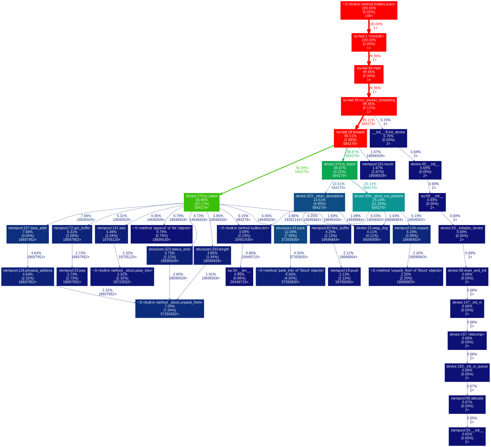
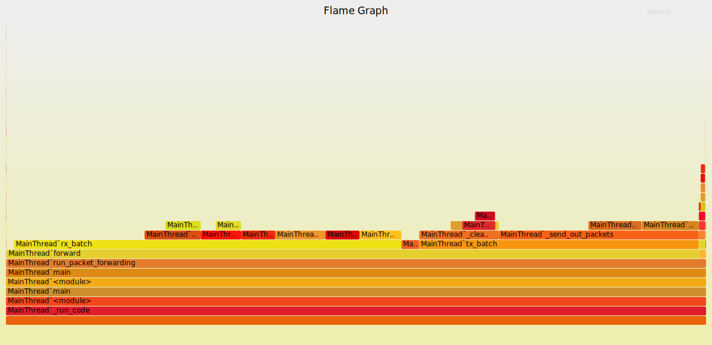

# ixy.py
[](./LICENSE)
[](https://github.com/ixy-languages/ixy.py)
[](https://github.com/ixy-languages/ixy.py)

ixy.py is a Python rewrite of the [ixy](https://github.com/emmericp/ixy) userspace network driver.
It is designed to be readable, idiomatic Python code.
It supports Intel 82599 10GbE (`ixgbe` family) and Virtio NICs.


## Build instructions
Install python3.6 or higher.

From source:
``` bash
# Install Python 3.7.2 (To be adapted accordingly for the version of choice)
PYTHON_VERSION=3.7.2
PYTHON_DIR="Python-$PYTHON_VERSION"
wget "https://www.python.org/ftp/python/$PYTHON_VERSION/$PYTHON_DIR.tgz"
tar xvf "$PYTHON_DIR.tgz"
rm "$PYTHON_DIR.tgz"
cd $PYTHON_DIR
./configure --enable-optimizations
make -j8
make altinstall
cd ..
rm -fr $PYTHON_DIR
```

Install pip
``` bash
wget https://bootstrap.pypa.io/get-pip.py
python3.7 get-pip.py
rm -f get-pip.py
```

Create a virtual environment
``` bash
python3.7 -m venv venv
source venv/bin/activate
```

Install cython
``` bash
pip install cython
```
or (from the project directory)
``` bash
pip install -r <path-to-project-directory>/requirements-dev.txt
```

Install __ixypy__
``` bash
pip install <path-to-project-directory>
```

Run one of the sample applications in the following way:
``` bash
python ixy-fwd.py <pci_1> <pci_2>
```
or
``` bash
python ixy-pktgen.py <pci>
```

## Disclaimer
ixypy is not production-ready. Do not use it in critical environments. DMA may corrupt memory.

## Other languages
Check out the [other ixy implementations](https://github.com/ixy-languages)

## Profiling
### cProfile


### Pystats

### Linux perf

